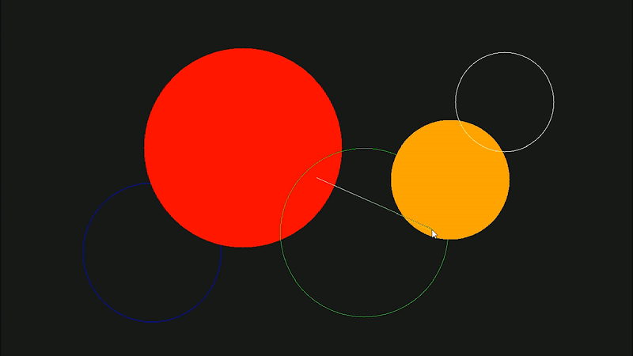

# TinyRaster

Implementing the fundamentals of a 2D graphics pipeline (implementation of skeleton code primarily contained in Rasterizer.cpp).  
Further detail regarding the exercises can be found <a href="Assignment spec.pdf" target="_blank">here</a>.  
My report explaining my approach to the exercises can be found <a href="Report.pdf" target="_blank">here</a>.

